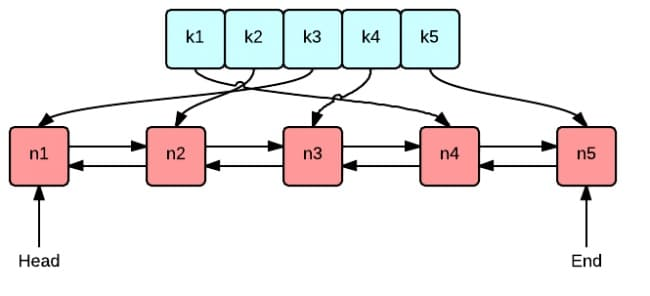

本文是[7天用Go从零实现分布式缓存GeeCache教程系列](https://geektutu.com/post/geecache.html)的第一篇。

- 介绍常用的三种缓存淘汰(失效)算法：FIFO，LFU 和 LRU
- 实现 LRU 缓存淘汰算法，**代码约80行**

## 1 FIFO/LFU/LRU 算法简介

GeeCache 的缓存全部存储在内存中，内存是有限的，因此不可能无限制地添加数据。假定我们设置缓存能够使用的内存大小为 N，那么在某一个时间点，添加了某一条缓存记录之后，占用内存超过了 N，这个时候就需要从缓存中移除一条或多条数据了。那移除谁呢？我们肯定希望尽可能移除“没用”的数据，那如何判定数据“有用”还是“没用”呢？

### 1.1 FIFO(First In First Out)

先进先出，也就是淘汰缓存中最老(最早添加)的记录。FIFO 认为，最早添加的记录，其不再被使用的可能性比刚添加的可能性大。这种算法的实现也非常简单，创建一个队列，新增记录添加到队尾，每次内存不够时，淘汰队首。但是很多场景下，部分记录虽然是最早添加但也最常被访问，而不得不因为呆的时间太长而被淘汰。这类数据会被频繁地添加进缓存，又被淘汰出去，导致缓存命中率降低。

### 1.2 LFU(Least Frequently Used)

最少使用，也就是淘汰缓存中访问频率最低的记录。LFU 认为，如果数据过去被访问多次，那么将来被访问的频率也更高。LFU 的实现需要维护一个按照访问次数排序的队列，每次访问，访问次数加1，队列重新排序，淘汰时选择访问次数最少的即可。LFU 算法的命中率是比较高的，但缺点也非常明显，维护每个记录的访问次数，对内存的消耗是很高的；另外，如果数据的访问模式发生变化，LFU 需要较长的时间去适应，也就是说 LFU 算法受历史数据的影响比较大。例如某个数据历史上访问次数奇高，但在某个时间点之后几乎不再被访问，但因为历史访问次数过高，而迟迟不能被淘汰。

### 1.3 LRU(Least Recently Used) 

最近最少使用，相对于仅考虑时间因素的 FIFO 和仅考虑访问频率的 LFU，LRU 算法可以认为是相对平衡的一种淘汰算法。LRU 认为，如果数据最近被访问过，那么将来被访问的概率也会更高。LRU 算法的实现非常简单，维护一个队列，如果某条记录被访问了，则移动到队尾，那么队首则是最近最少访问的数据，淘汰该条记录即可。

## 2 LRU 算法实现

### 2.1 核心数据结构



这张图很好地表示了 LRU 算法最核心的 2 个数据结构

- 绿色的是字典(map)，存储键和值的映射关系。这样根据某个键(key)查找对应的值(value)的复杂是`O(1)`，在字典中插入一条记录的复杂度也是`O(1)`。
- 红色的是双向链表(double linked list)实现的队列。将所有的值放到双向链表中，这样，当访问到某个值时，将其移动到队尾的复杂度是`O(1)`，在队尾新增一条记录以及删除一条记录的复杂度均为`O(1)`。

接下来我们创建一个包含字典和双向链表的结构体类型 Cache，方便实现后续的增删查改操作。

[day1-lru/geecache/lru/lru.go - github](https://github.com/geektutu/7days-golang/tree/master/gee-cache/day1-lru/geecache/lru)

```go
package lru

import "container/list"

// Cache is a LRU cache. It is not safe for concurrent access.
type Cache struct {
	maxBytes int64
	nbytes   int64
	ll       *list.List
	cache    map[string]*list.Element
	// optional and executed when an entry is purged.
	OnEvicted func(key string, value Value)
}

type entry struct {
	key   string
	value Value
}

// Value use Len to count how many bytes it takes
type Value interface {
	Len() int
}
```

- 在这里我们直接使用 Go 语言标准库实现的双向链表`list.List`。
- 字典的定义是 `map[string]*list.Element`，键是字符串，值是双向链表中对应节点的指针。
- `maxBytes` 是允许使用的最大内存，`nbytes` 是当前已使用的内存，`OnEvicted` 是某条记录被移除时的回调函数，可以为 nil。
- 键值对 `entry` 是双向链表节点的数据类型，在链表中仍保存每个值对应的 key 的好处在于，淘汰队首节点时，需要用 key 从字典中删除对应的映射。
- 为了通用性，我们允许值是实现了 `Value` 接口的任意类型，该接口只包含了一个方法 `Len() int`，用于返回值所占用的内存大小。


方便实例化 `Cache`，实现 `New()` 函数：

```go
// New is the Constructor of Cache
func New(maxBytes int64, onEvicted func(string, Value)) *Cache {
	return &Cache{
		maxBytes:  maxBytes,
		ll:        list.New(),
		cache:     make(map[string]*list.Element),
		OnEvicted: onEvicted,
	}
}
```

### 2.2 查找功能

查找主要有 2 个步骤，第一步是从字典中找到对应的双向链表的节点，第二步，将该节点移动到队尾。

```go
// Get look ups a key's value
func (c *Cache) Get(key string) (value Value, ok bool) {
	if ele, ok := c.cache[key]; ok {
		c.ll.MoveToFront(ele)
		kv := ele.Value.(*entry)
		return kv.value, true
	}
	return
}
```

- 如果键对应的链表节点存在，则将对应节点移动到队尾，并返回查找到的值。
- `c.ll.MoveToFront(ele)`，即将链表中的节点 `ele` 移动到队尾（双向链表作为队列，队首队尾是相对的，在这里约定 front 为队尾）

### 2.3 删除

这里的删除，实际上是缓存淘汰。即移除最近最少访问的节点（队首）

```go
// RemoveOldest removes the oldest item
func (c *Cache) RemoveOldest() {
	ele := c.ll.Back()
	if ele != nil {
		c.ll.Remove(ele)
		kv := ele.Value.(*entry)
		delete(c.cache, kv.key)
		c.nbytes -= int64(len(kv.key)) + int64(kv.value.Len())
		if c.OnEvicted != nil {
			c.OnEvicted(kv.key, kv.value)
		}
	}
}
```

- `c.ll.Back()` 取到队首节点，从链表中删除。
- `delete(c.cache, kv.key)`，从字典中 `c.cache` 删除该节点的映射关系。
- 更新当前所用的内存 `c.nbytes`。
- 如果回调函数 `OnEvicted` 不为 nil，则调用回调函数。

### 2.4 新增/修改

```go
// Add adds a value to the cache.
func (c *Cache) Add(key string, value Value) {
	if ele, ok := c.cache[key]; ok {
		c.ll.MoveToFront(ele)
		kv := ele.Value.(*entry)
		c.nbytes += int64(value.Len()) - int64(kv.value.Len())
		kv.value = value
	} else {
		ele := c.ll.PushFront(&entry{key, value})
		c.cache[key] = ele
		c.nbytes += int64(len(key)) + int64(value.Len())
	}
	for c.maxBytes != 0 && c.maxBytes < c.nbytes {
		c.RemoveOldest()
	}
}
```

- 如果键存在，则更新对应节点的值，并将该节点移到队尾。
- 不存在则是新增场景，首先队尾添加新节点 `&entry{key, value}`, 并字典中添加 key 和节点的映射关系。
- 更新 `c.nbytes`，如果超过了设定的最大值 `c.maxBytes`，则移除最少访问的节点。

最后，为了方便测试，我们实现 `Len()` 用来获取添加了多少条数据。

```go
// Len the number of cache entries
func (c *Cache) Len() int {
	return c.ll.Len()
}
```

## 3 测试

例如，我们可以尝试添加几条数据，测试 `Get` 方法

[day1-lru/geecache/lru/lru_test.go - github](https://github.com/geektutu/7days-golang/tree/master/gee-cache/day1-lru/geecache/lru)

```go
type String string

func (d String) Len() int {
	return len(d)
}

func TestGet(t *testing.T) {
	lru := New(int64(0), nil)
	lru.Add("key1", String("1234"))
	if v, ok := lru.Get("key1"); !ok || string(v.(String)) != "1234" {
		t.Fatalf("cache hit key1=1234 failed")
	}
	if _, ok := lru.Get("key2"); ok {
		t.Fatalf("cache miss key2 failed")
	}
}
```

测试，当使用内存超过了设定值时，是否会触发“无用”节点的移除：

```go
func TestRemoveoldest(t *testing.T) {
	k1, k2, k3 := "key1", "key2", "k3"
	v1, v2, v3 := "value1", "value2", "v3"
	cap := len(k1 + k2 + v1 + v2)
	lru := New(int64(cap), nil)
	lru.Add(k1, String(v1))
	lru.Add(k2, String(v2))
	lru.Add(k3, String(v3))

	if _, ok := lru.Get("key1"); ok || lru.Len() != 2 {
		t.Fatalf("Removeoldest key1 failed")
	}
}
```

测试回调函数能否被调用：

```go
func TestOnEvicted(t *testing.T) {
	keys := make([]string, 0)
	callback := func(key string, value Value) {
		keys = append(keys, key)
	}
	lru := New(int64(10), callback)
	lru.Add("key1", String("123456"))
	lru.Add("k2", String("k2"))
	lru.Add("k3", String("k3"))
	lru.Add("k4", String("k4"))

	expect := []string{"key1", "k2"}

	if !reflect.DeepEqual(expect, keys) {
		t.Fatalf("Call OnEvicted failed, expect keys equals to %s", expect)
	}
}
```

## 附 推荐阅读

- [Go 语言简明教程](https://geektutu.com/post/quick-golang.html)
- [Go Test 单元测试简明教程](https://geektutu.com/post/quick-go-test.html)
- [list 官方文档 - golang.org](https://golang.org/pkg/container/list/)