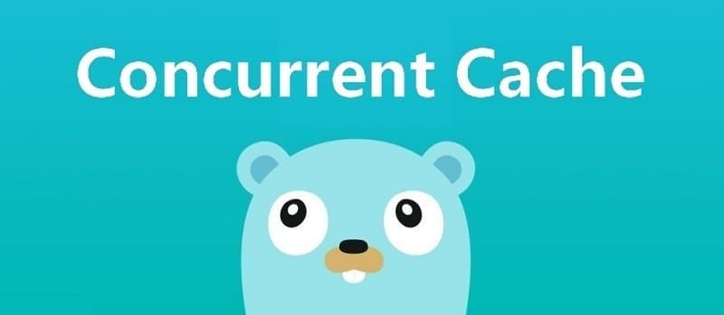

本文是[7天用Go从零实现分布式缓存GeeCache](https://geektutu.com/post/geecache.html)的第二篇。

- 介绍 sync.Mutex 互斥锁的使用，并实现 LRU 缓存的并发控制。
- 实现 GeeCache 核心数据结构 Group，缓存不存在时，调用回调函数获取源数据，**代码约150行**

## 1 sync.Mutex

多个协程(goroutine)同时读写同一个变量，在并发度较高的情况下，会发生冲突。确保一次只有一个协程(goroutine)可以访问该变量以避免冲突，这称之为`互斥`，互斥锁可以解决这个问题。

> sync.Mutex 是一个互斥锁，可以由不同的协程加锁和解锁。

`sync.Mutex` 是 Go 语言标准库提供的一个互斥锁，当一个协程(goroutine)获得了这个锁的拥有权后，其它请求锁的协程(goroutine) 就会阻塞在 `Lock()` 方法的调用上，直到调用 `Unlock()` 锁被释放。

接下来举一个简单的例子，假设有10个并发的协程打印了同一个数字`100`，为了避免重复打印，实现了`printOnce(num int)` 函数，使用集合 set 记录已打印过的数字，如果数字已打印过，则不再打印。

```go
var set = make(map[int]bool, 0)

func printOnce(num int) {
	if _, exist := set[num]; !exist {
		fmt.Println(num)
	}
	set[num] = true
}

func main() {
	for i := 0; i < 10; i++ {
		go printOnce(100)
	}
	time.Sleep(time.Second)
}
```

我们运行 `go run .` 会发生什么情况呢？

```bash
$ go run .
100
100
```

有时候打印 2 次，有时候打印 4 次，有时候还会触发 panic，因为对同一个数据结构`set`的访问冲突了。接下来用互斥锁的`Lock()`和`Unlock()` 方法将冲突的部分包裹起来：

```go
var m sync.Mutex
var set = make(map[int]bool, 0)

func printOnce(num int) {
	m.Lock()
	if _, exist := set[num]; !exist {
		fmt.Println(num)
	}
	set[num] = true
	m.Unlock()
}

func main() {
	for i := 0; i < 10; i++ {
		go printOnce(100)
	}
	time.Sleep(time.Second)
}
```

```bash
$ go run .
100
```

相同的数字只会被打印一次。当一个协程调用了 `Lock()` 方法时，其他协程被阻塞了，直到`Unlock()`调用将锁释放。因此被包裹部分的代码就能够避免冲突，实现互斥。

`Unlock()`释放锁还有另外一种写法：

```go
func printOnce(num int) {
	m.Lock()
	defer m.Unlock()
	if _, exist := set[num]; !exist {
		fmt.Println(num)
	}
	set[num] = true
}
```

## 2 支持并发读写

上一篇文章 [GeeCache 第一天](https://geektutu.com/post/geecache-day1.html) 实现了 LRU 缓存淘汰策略。接下来我们使用 `sync.Mutex` 封装 LRU 的几个方法，使之支持并发的读写。在这之前，我们抽象了一个只读数据结构 `ByteView` 用来表示缓存值，是 GeeCache 主要的数据结构之一。

[day2-single-node/geecache/byteview.go - github](https://github.com/geektutu/7days-golang/tree/master/gee-cache/day2-single-node/geecache)

```go
package geecache

// A ByteView holds an immutable view of bytes.
type ByteView struct {
	b []byte
}

// Len returns the view's length
func (v ByteView) Len() int {
	return len(v.b)
}

// ByteSlice returns a copy of the data as a byte slice.
func (v ByteView) ByteSlice() []byte {
	return cloneBytes(v.b)
}

// String returns the data as a string, making a copy if necessary.
func (v ByteView) String() string {
	return string(v.b)
}

func cloneBytes(b []byte) []byte {
	c := make([]byte, len(b))
	copy(c, b)
	return c
}
```

- ByteView 只有一个数据成员，`b []byte`，b 将会存储真实的缓存值。选择 byte 类型是为了能够支持任意的数据类型的存储，例如字符串、图片等。
- 实现 `Len() int` 方法，我们在 lru.Cache 的实现中，要求被缓存对象必须实现 Value 接口，即 `Len() int` 方法，返回其所占的内存大小。
- `b` 是只读的，使用 `ByteSlice()` 方法返回一个拷贝，防止缓存值被外部程序修改。

接下来就可以为 lru.Cache 添加并发特性了。

[day2-single-node/geecache/cache.go - github](https://github.com/geektutu/7days-golang/tree/master/gee-cache/day2-single-node/geecache)

```go
package geecache

import (
	"geecache/lru"
	"sync"
)

type cache struct {
	mu         sync.Mutex
	lru        *lru.Cache
	cacheBytes int64
}

func (c *cache) add(key string, value ByteView) {
	c.mu.Lock()
	defer c.mu.Unlock()
	if c.lru == nil {
		c.lru = lru.New(c.cacheBytes, nil)
	}
	c.lru.Add(key, value)
}

func (c *cache) get(key string) (value ByteView, ok bool) {
	c.mu.Lock()
	defer c.mu.Unlock()
	if c.lru == nil {
		return
	}

	if v, ok := c.lru.Get(key); ok {
		return v.(ByteView), ok
	}

	return
}
```

- `cache.go` 的实现非常简单，实例化 lru，封装 get 和 add 方法，并添加互斥锁 mu。
- 在 `add` 方法中，判断了 `c.lru` 是否为 nil，如果等于 nil 再创建实例。这种方法称之为延迟初始化(Lazy Initialization)，一个对象的延迟初始化意味着该对象的创建将会延迟至第一次使用该对象时。主要用于提高性能，并减少程序内存要求。

## 3 主体结构 Group

Group 是 GeeCache 最核心的数据结构，负责与用户的交互，并且控制缓存值存储和获取的流程。

```bash
                            是
接收 key --> 检查是否被缓存 -----> 返回缓存值 ⑴
                |  否                         是
                |-----> 是否应当从远程节点获取 -----> 与远程节点交互 --> 返回缓存值 ⑵
                            |  否
                            |-----> 调用`回调函数`，获取值并添加到缓存 --> 返回缓存值 ⑶
```

我们将在 `geecache.go` 中实现主体结构 Group，那么 GeeCache 的代码结构的雏形已经形成了。

```bash
geecache/
    |--lru/
        |--lru.go  // lru 缓存淘汰策略
    |--byteview.go // 缓存值的抽象与封装
    |--cache.go    // 并发控制
    |--geecache.go // 负责与外部交互，控制缓存存储和获取的主流程
```

接下来我们将实现流程 ⑴ 和 ⑶，远程交互的部分后续再实现。


### 3.1 回调 Getter

我们思考一下，如果缓存不存在，应从数据源（文件，数据库等）获取数据并添加到缓存中。GeeCache 是否应该支持多种数据源的配置呢？不应该，一是数据源的种类太多，没办法一一实现；二是扩展性不好。如何从源头获取数据，应该是用户决定的事情，我们就把这件事交给用户好了。因此，我们设计了一个回调函数(callback)，在缓存不存在时，调用这个函数，得到源数据。

[day2-single-node/geecache/geecache.go - github](https://github.com/geektutu/7days-golang/tree/master/gee-cache/day2-single-node/geecache)

```go
// A Getter loads data for a key.
type Getter interface {
	Get(key string) ([]byte, error)
}

// A GetterFunc implements Getter with a function.
type GetterFunc func(key string) ([]byte, error)

// Get implements Getter interface function
func (f GetterFunc) Get(key string) ([]byte, error) {
	return f(key)
}
```

- 定义接口 Getter 和 回调函数 `Get(key string)([]byte, error)`，参数是 key，返回值是 []byte。
- 定义函数类型 GetterFunc，并实现 Getter 接口的 `Get` 方法。
- 函数类型实现某一个接口，称之为接口型函数，方便使用者在调用时既能够传入函数作为参数，也能够传入实现了该接口的结构体作为参数。

> 了解接口型函数的使用场景，可以参考 [Go 接口型函数的使用场景 - 7days-golang Q & A](https://geektutu.com/post/7days-golang-q1.html)

我们可以写一个测试用例来保证回调函数能够正常工作。

```go
func TestGetter(t *testing.T) {
	var f Getter = GetterFunc(func(key string) ([]byte, error) {
		return []byte(key), nil
	})

	expect := []byte("key")
	if v, _ := f.Get("key"); !reflect.DeepEqual(v, expect) {
		t.Errorf("callback failed")
	}
}
```

- 在这个测试用例中，我们借助 GetterFunc 的类型转换，将一个匿名回调函数转换成了接口 `f Getter`。
- 调用该接口的方法 `f.Get(key string)`，实际上就是在调用匿名回调函数。

> 定义一个函数类型 F，并且实现接口 A 的方法，然后在这个方法中调用自己。这是 Go 语言中将其他函数（参数返回值定义与 F 一致）转换为接口 A 的常用技巧。

### 3.2 Group 的定义

接下来是最核心数据结构 Group 的定义：

[day2-single-node/geecache/geecache.go - github](https://github.com/geektutu/7days-golang/tree/master/gee-cache/day2-single-node/geecache)

```go
// A Group is a cache namespace and associated data loaded spread over
type Group struct {
	name      string
	getter    Getter
	mainCache cache
}

var (
	mu     sync.RWMutex
	groups = make(map[string]*Group)
)

// NewGroup create a new instance of Group
func NewGroup(name string, cacheBytes int64, getter Getter) *Group {
	if getter == nil {
		panic("nil Getter")
	}
	mu.Lock()
	defer mu.Unlock()
	g := &Group{
		name:      name,
		getter:    getter,
		mainCache: cache{cacheBytes: cacheBytes},
	}
	groups[name] = g
	return g
}

// GetGroup returns the named group previously created with NewGroup, or
// nil if there's no such group.
func GetGroup(name string) *Group {
	mu.RLock()
	g := groups[name]
	mu.RUnlock()
	return g
}
```

- 一个 Group 可以认为是一个缓存的命名空间，每个 Group 拥有一个唯一的名称 `name`。比如可以创建三个 Group，缓存学生的成绩命名为 scores，缓存学生信息的命名为 info，缓存学生课程的命名为 courses。
- 第二个属性是 `getter Getter`，即缓存未命中时获取源数据的回调(callback)。
- 第三个属性是 `mainCache cache`，即一开始实现的并发缓存。
- 构建函数 `NewGroup` 用来实例化 Group，并且将 group 存储在全局变量 `groups` 中。
- `GetGroup` 用来特定名称的 Group，这里使用了只读锁 `RLock()`，因为不涉及任何冲突变量的写操作。

### 3.3 Group 的 Get 方法

接下来是 GeeCache 最为核心的方法 `Get`：

```go
// Get value for a key from cache
func (g *Group) Get(key string) (ByteView, error) {
	if key == "" {
		return ByteView{}, fmt.Errorf("key is required")
	}

	if v, ok := g.mainCache.get(key); ok {
		log.Println("[GeeCache] hit")
		return v, nil
	}

	return g.load(key)
}

func (g *Group) load(key string) (value ByteView, err error) {
	return g.getLocally(key)
}

func (g *Group) getLocally(key string) (ByteView, error) {
	bytes, err := g.getter.Get(key)
	if err != nil {
		return ByteView{}, err

	}
	value := ByteView{b: cloneBytes(bytes)}
	g.populateCache(key, value)
	return value, nil
}

func (g *Group) populateCache(key string, value ByteView) {
	g.mainCache.add(key, value)
}
```

- Get 方法实现了上述所说的流程 ⑴ 和 ⑶。
- 流程 ⑴ ：从 mainCache 中查找缓存，如果存在则返回缓存值。
- 流程 ⑶ ：缓存不存在，则调用 load 方法，load 调用 getLocally（分布式场景下会调用 getFromPeer 从其他节点获取），getLocally 调用用户回调函数 `g.getter.Get()` 获取源数据，并且将源数据添加到缓存 mainCache 中（通过 populateCache 方法）

至此，这一章节的单机并发缓存就已经完成了。

## 4 测试

可以写测试用例，也可以写 main 函数来测试这一章节实现的功能。那我们通过测试用例来看一下，如何使用我们实现的单机并发缓存吧。

首先，用一个 map 模拟耗时的数据库。

```go
var db = map[string]string{
	"Tom":  "630",
	"Jack": "589",
	"Sam":  "567",
}
```

创建 group 实例，并测试 `Get` 方法

```go
func TestGet(t *testing.T) {
	loadCounts := make(map[string]int, len(db))
	gee := NewGroup("scores", 2<<10, GetterFunc(
		func(key string) ([]byte, error) {
			log.Println("[SlowDB] search key", key)
			if v, ok := db[key]; ok {
				if _, ok := loadCounts[key]; !ok {
					loadCounts[key] = 0
				}
				loadCounts[key] += 1
				return []byte(v), nil
			}
			return nil, fmt.Errorf("%s not exist", key)
		}))

	for k, v := range db {
		if view, err := gee.Get(k); err != nil || view.String() != v {
			t.Fatal("failed to get value of Tom")
		} // load from callback function
		if _, err := gee.Get(k); err != nil || loadCounts[k] > 1 {
			t.Fatalf("cache %s miss", k)
		} // cache hit
	}

	if view, err := gee.Get("unknown"); err == nil {
		t.Fatalf("the value of unknow should be empty, but %s got", view)
	}
}
```

- 在这个测试用例中，我们主要测试了 2 种情况
- 1）在缓存为空的情况下，能够通过回调函数获取到源数据。
- 2）在缓存已经存在的情况下，是否直接从缓存中获取，为了实现这一点，使用 `loadCounts` 统计某个键调用回调函数的次数，如果次数大于1，则表示调用了多次回调函数，没有缓存。

测试结果如下：

```bash
$ go test -run TestGet
2020/02/11 22:07:31 [SlowDB] search key Sam
2020/02/11 22:07:31 [GeeCache] hit
2020/02/11 22:07:31 [SlowDB] search key Tom
2020/02/11 22:07:31 [GeeCache] hit
2020/02/11 22:07:31 [SlowDB] search key Jack
2020/02/11 22:07:31 [GeeCache] hit
2020/02/11 22:07:31 [SlowDB] search key unknown
PASS
ok      geecache        0.008s
```

可以很清晰地看到，缓存为空时，调用了回调函数，第二次访问时，则直接从缓存中读取。

## 附 推荐阅读

- [Go 语言简明教程 - 并发编程](https://geektutu.com/post/quick-golang.html#7-并发编程-goroutine)
- [Go Test 单元测试简明教程](https://geektutu.com/post/quick-go-test.html)
- [sync 官方文档 - golang.org](https://golang.org/pkg/sync/)
