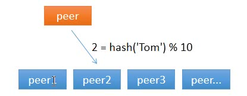
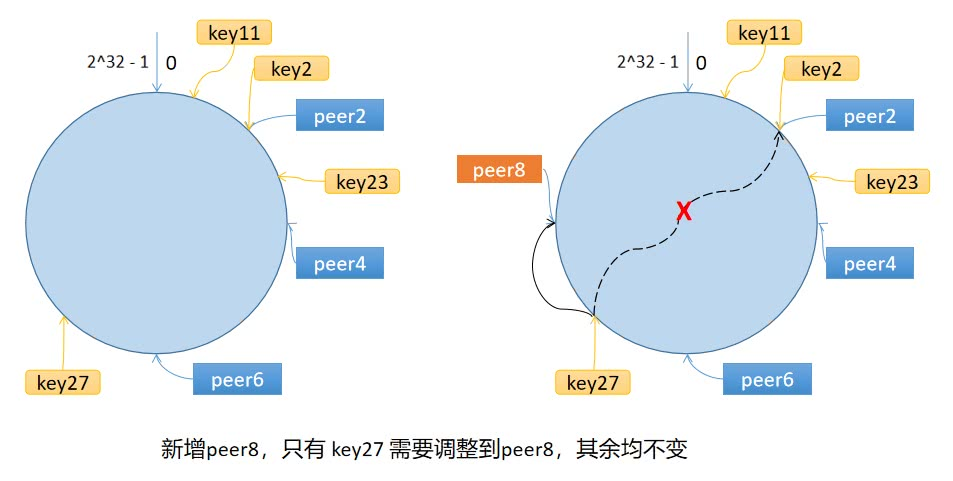

本文是[7天用Go从零实现分布式缓存GeeCache](https://geektutu.com/post/geecache.html)的第四篇。

- 一致性哈希(consistent hashing)的原理以及为什么要使用一致性哈希。
- 实现一致性哈希代码，添加相应的测试用例，**代码约60行**

## 1 为什么使用一致性哈希

今天我们要实现的是一致性哈希算法，一致性哈希算法是 GeeCache 从单节点走向分布式节点的一个重要的环节。那你可能要问了，

> 童鞋，一致性哈希算法是啥？为什么要使用一致性哈希算法？这和分布式有什么关系？

### 1.1 我该访问谁？

对于分布式缓存来说，当一个节点接收到请求，如果该节点并没有存储缓存值，那么它面临的难题是，从谁那获取数据？自己，还是节点1, 2, 3, 4... 。假设包括自己在内一共有 10 个节点，当一个节点接收到请求时，随机选择一个节点，由该节点从数据源获取数据。

假设第一次随机选取了节点 1 ，节点 1 从数据源获取到数据的同时缓存该数据；那第二次，只有 1/10 的可能性再次选择节点 1, 有 9/10 的概率选择了其他节点，如果选择了其他节点，就意味着需要再一次从数据源获取数据，一般来说，这个操作是很耗时的。这样做，一是缓存效率低，二是各个节点上存储着相同的数据，浪费了大量的存储空间。

那有什么办法，对于给定的 key，每一次都选择同一个节点呢？使用 hash 算法也能够做到这一点。那把 key 的每一个字符的 ASCII 码加起来，再除以 10 取余数可以吗？当然可以，这可以认为是自定义的 hash 算法。



从上面的图可以看到，任意一个节点任意时刻请求查找键 `Tom` 对应的值，都会分配给节点 2，有效地解决了上述的问题。

### 1.2 节点数量变化了怎么办？

简单求取 Hash 值解决了缓存性能的问题，但是没有考虑节点数量变化的场景。假设，移除了其中一台节点，只剩下 9 个，那么之前 `hash(key) % 10` 变成了 `hash(key) % 9`，也就意味着几乎缓存值对应的节点都发生了改变。即几乎所有的缓存值都失效了。节点在接收到对应的请求时，均需要重新去数据源获取数据，容易引起 `缓存雪崩`。

> 缓存雪崩：缓存在同一时刻全部失效，造成瞬时DB请求量大、压力骤增，引起雪崩。常因为缓存服务器宕机，或缓存设置了相同的过期时间引起。

那如何解决这个问题呢？一致性哈希算法可以。

## 2 算法原理

### 2.1 步骤

一致性哈希算法将 key 映射到 2^32 的空间中，将这个数字首尾相连，形成一个环。

- 计算节点/机器(通常使用节点的名称、编号和 IP 地址)的哈希值，放置在环上。
- 计算 key 的哈希值，放置在环上，顺时针寻找到的第一个节点，就是应选取的节点/机器。



环上有 peer2，peer4，peer6 三个节点，`key11`，`key2`，`key27` 均映射到 peer2，`key23` 映射到 peer4。此时，如果新增节点/机器 peer8，假设它新增位置如图所示，那么只有 `key27` 从  peer2 调整到  peer8，其余的映射均没有发生改变。

也就是说，一致性哈希算法，在新增/删除节点时，只需要重新定位该节点附近的一小部分数据，而不需要重新定位所有的节点，这就解决了上述的问题。

### 2.2 数据倾斜问题

如果服务器的节点过少，容易引起 key 的倾斜。例如上面例子中的 peer2，peer4，peer6 分布在环的上半部分，下半部分是空的。那么映射到环下半部分的 key 都会被分配给 peer2，key 过度向 peer2 倾斜，缓存节点间负载不均。

为了解决这个问题，引入了虚拟节点的概念，一个真实节点对应多个虚拟节点。

假设 1 个真实节点对应 3 个虚拟节点，那么 peer1 对应的虚拟节点是  peer1-1、 peer1-2、 peer1-3（通常以添加编号的方式实现），其余节点也以相同的方式操作。

- 第一步，计算虚拟节点的 Hash 值，放置在环上。
- 第二步，计算 key 的 Hash 值，在环上顺时针寻找到应选取的虚拟节点，例如是 peer2-1，那么就对应真实节点 peer2。

虚拟节点扩充了节点的数量，解决了节点较少的情况下数据容易倾斜的问题。而且代价非常小，只需要增加一个字典(map)维护真实节点与虚拟节点的映射关系即可。

## 3 Go语言实现

我们在 geecache 目录下新建 package `consistenthash`，用来实现一致性哈希算法。

[day4-consistent-hash/geecache/consistenthash/consistenthash.go](https://github.com/geektutu/7days-golang/tree/master/gee-cache/day4-consistent-hash/geecache/consistenthash)

```go
package consistenthash

import (
	"hash/crc32"
	"sort"
	"strconv"
)

// Hash maps bytes to uint32
type Hash func(data []byte) uint32

// Map constains all hashed keys
type Map struct {
	hash     Hash
	replicas int
	keys     []int // Sorted
	hashMap  map[int]string
}

// New creates a Map instance
func New(replicas int, fn Hash) *Map {
	m := &Map{
		replicas: replicas,
		hash:     fn,
		hashMap:  make(map[int]string),
	}
	if m.hash == nil {
		m.hash = crc32.ChecksumIEEE
	}
	return m
}
```

- 定义了函数类型 `Hash`，采取依赖注入的方式，允许用于替换成自定义的 Hash 函数，也方便测试时替换，默认为 `crc32.ChecksumIEEE` 算法。
- `Map` 是一致性哈希算法的主数据结构，包含 4 个成员变量：Hash 函数 `hash`；虚拟节点倍数 `replicas`；哈希环 `keys`；虚拟节点与真实节点的映射表 `hashMap`，键是虚拟节点的哈希值，值是真实节点的名称。
- 构造函数 `New()` 允许自定义虚拟节点倍数和 Hash 函数。

接下来，实现添加真实节点/机器的 `Add()` 方法。

```go
// Add adds some keys to the hash.
func (m *Map) Add(keys ...string) {
	for _, key := range keys {
		for i := 0; i < m.replicas; i++ {
			hash := int(m.hash([]byte(strconv.Itoa(i) + key)))
			m.keys = append(m.keys, hash)
			m.hashMap[hash] = key
		}
	}
	sort.Ints(m.keys)
}
```

- `Add` 函数允许传入 0 或 多个真实节点的名称。
- 对每一个真实节点 `key`，对应创建 `m.replicas` 个虚拟节点，虚拟节点的名称是：`strconv.Itoa(i) + key`，即通过添加编号的方式区分不同虚拟节点。
- 使用 `m.hash()` 计算虚拟节点的哈希值，使用 `append(m.keys, hash)` 添加到环上。
- 在 `hashMap` 中增加虚拟节点和真实节点的映射关系。
- 最后一步，环上的哈希值排序。

最后一步，实现选择节点的 `Get()` 方法。

```go
// Get gets the closest item in the hash to the provided key.
func (m *Map) Get(key string) string {
	if len(m.keys) == 0 {
		return ""
	}

	hash := int(m.hash([]byte(key)))
	// Binary search for appropriate replica.
	idx := sort.Search(len(m.keys), func(i int) bool {
		return m.keys[i] >= hash
	})

	return m.hashMap[m.keys[idx%len(m.keys)]]
}
```

- 选择节点就非常简单了，第一步，计算 key 的哈希值。
- 第二步，顺时针找到第一个匹配的虚拟节点的下标 `idx`，从 m.keys 中获取到对应的哈希值。如果 `idx == len(m.keys)`，说明应选择 `m.keys[0]`，因为 `m.keys` 是一个环状结构，所以用取余数的方式来处理这种情况。
- 第三步，通过 `hashMap` 映射得到真实的节点。

至此，整个一致性哈希算法就实现完成了。

## 4 测试

最后呢，需要测试用例来验证我们的实现是否有问题。

[day4-consistent-hash/geecache/consistenthash/consistenthash_test.go](https://github.com/geektutu/7days-golang/tree/master/gee-cache/day4-consistent-hash/geecache/consistenthash)

```go
package consistenthash

import (
	"strconv"
	"testing"
)

func TestHashing(t *testing.T) {
	hash := New(3, func(key []byte) uint32 {
		i, _ := strconv.Atoi(string(key))
		return uint32(i)
	})

	// Given the above hash function, this will give replicas with "hashes":
	// 2, 4, 6, 12, 14, 16, 22, 24, 26
	hash.Add("6", "4", "2")

	testCases := map[string]string{
		"2":  "2",
		"11": "2",
		"23": "4",
		"27": "2",
	}

	for k, v := range testCases {
		if hash.Get(k) != v {
			t.Errorf("Asking for %s, should have yielded %s", k, v)
		}
	}

	// Adds 8, 18, 28
	hash.Add("8")

	// 27 should now map to 8.
	testCases["27"] = "8"

	for k, v := range testCases {
		if hash.Get(k) != v {
			t.Errorf("Asking for %s, should have yielded %s", k, v)
		}
	}

}
```

如果要进行测试，那么我们需要明确地知道每一个传入的 key 的哈希值，那使用默认的 `crc32.ChecksumIEEE` 算法显然达不到目的。所以在这里使用了自定义的 Hash 算法。自定义的 Hash 算法只处理数字，传入字符串表示的数字，返回对应的数字即可。

- 一开始，有 2/4/6 三个真实节点，对应的虚拟节点的哈希值是 02/12/22、04/14/24、06/16/26。
- 那么用例 2/11/23/27 选择的虚拟节点分别是 02/12/24/02，也就是真实节点 2/2/4/2。
- 添加一个真实节点 8，对应虚拟节点的哈希值是 08/18/28，此时，用例 27 对应的虚拟节点从 `02` 变更为 `28`，即真实节点 8。

## 附 推荐阅读

- [Go 语言简明教程](https://geektutu.com/post/quick-golang.html)
- [Go Test 单元测试简明教程](https://geektutu.com/post/quick-go-test.html)