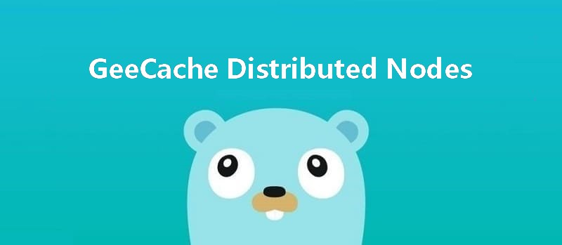

本文是[7天用Go从零实现分布式缓存GeeCache](https://geektutu.com/post/geecache.html)的第五篇。

- 注册节点(Register Peers)，借助一致性哈希算法选择节点。
- 实现 HTTP 客户端，与远程节点的服务端通信，**代码约90行**

## 1 流程回顾

```bash
                            是
接收 key --> 检查是否被缓存 -----> 返回缓存值 ⑴
                |  否                         是
                |-----> 是否应当从远程节点获取 -----> 与远程节点交互 --> 返回缓存值 ⑵
                            |  否
                            |-----> 调用`回调函数`，获取值并添加到缓存 --> 返回缓存值 ⑶
```

我们在[GeeCache 第二天](https://geektutu.com/post/geecache-day2.html) 中描述了 geecache 的流程。在这之前已经实现了流程 ⑴ 和 ⑶，今天实现流程 ⑵，从远程节点获取缓存值。

我们进一步细化流程 ⑵：

```bash
使用一致性哈希选择节点        是                                    是
    |-----> 是否是远程节点 -----> HTTP 客户端访问远程节点 --> 成功？-----> 服务端返回返回值
                    |  否                                    ↓  否
                    |----------------------------> 回退到本地节点处理。
```

## 2 抽象 PeerPicker

[day5-multi-nodes/geecache/peers.go - github](https://github.com/geektutu/7days-golang/tree/master/gee-cache/day5-multi-nodes/geecache)


```go
package geecache

// PeerPicker is the interface that must be implemented to locate
// the peer that owns a specific key.
type PeerPicker interface {
	PickPeer(key string) (peer PeerGetter, ok bool)
}

// PeerGetter is the interface that must be implemented by a peer.
type PeerGetter interface {
	Get(group string, key string) ([]byte, error)
}
```

- 在这里，抽象出 2 个接口，PeerPicker 的 `PickPeer()` 方法用于根据传入的 key 选择相应节点 PeerGetter。
- 接口 PeerGetter 的 `Get()` 方法用于从对应 group 查找缓存值。PeerGetter 就对应于上述流程中的 HTTP 客户端。

## 3 节点选择与 HTTP 客户端


在 [GeeCache 第三天](https://geektutu.com/post/geecache-day3.html) 中我们为 `HTTPPool` 实现了服务端功能，通信不仅需要服务端还需要客户端，因此，我们接下来要为 `HTTPPool` 实现客户端的功能。

首先创建具体的 HTTP 客户端类 `httpGetter`，实现 PeerGetter 接口。

[day5-multi-nodes/geecache/http.go - github](https://github.com/geektutu/7days-golang/tree/master/gee-cache/day5-multi-nodes/geecache)

```go
type httpGetter struct {
	baseURL string
}

func (h *httpGetter) Get(group string, key string) ([]byte, error) {
	u := fmt.Sprintf(
		"%v%v/%v",
		h.baseURL,
		url.QueryEscape(group),
		url.QueryEscape(key),
	)
	res, err := http.Get(u)
	if err != nil {
		return nil, err
	}
	defer res.Body.Close()

	if res.StatusCode != http.StatusOK {
		return nil, fmt.Errorf("server returned: %v", res.Status)
	}

	bytes, err := ioutil.ReadAll(res.Body)
	if err != nil {
		return nil, fmt.Errorf("reading response body: %v", err)
	}

	return bytes, nil
}

var _ PeerGetter = (*httpGetter)(nil)
```

- baseURL 表示将要访问的远程节点的地址，例如 `http://example.com/_geecache/`。
- 使用 `http.Get()` 方式获取返回值，并转换为 `[]bytes` 类型。

第二步，为 HTTPPool 添加节点选择的功能。

```go
const (
	defaultBasePath = "/_geecache/"
	defaultReplicas = 50
)
// HTTPPool implements PeerPicker for a pool of HTTP peers.
type HTTPPool struct {
	// this peer's base URL, e.g. "https://example.net:8000"
	self        string
	basePath    string
	mu          sync.Mutex // guards peers and httpGetters
	peers       *consistenthash.Map
	httpGetters map[string]*httpGetter // keyed by e.g. "http://10.0.0.2:8008"
}
```

- 新增成员变量 `peers`，类型是一致性哈希算法的 `Map`，用来根据具体的 key 选择节点。
- 新增成员变量 `httpGetters`，映射远程节点与对应的 httpGetter。每一个远程节点对应一个 httpGetter，因为 httpGetter 与远程节点的地址 `baseURL` 有关。

第三步，实现 PeerPicker 接口。

```go
// Set updates the pool's list of peers.
func (p *HTTPPool) Set(peers ...string) {
	p.mu.Lock()
	defer p.mu.Unlock()
	p.peers = consistenthash.New(defaultReplicas, nil)
	p.peers.Add(peers...)
	p.httpGetters = make(map[string]*httpGetter, len(peers))
	for _, peer := range peers {
		p.httpGetters[peer] = &httpGetter{baseURL: peer + p.basePath}
	}
}

// PickPeer picks a peer according to key
func (p *HTTPPool) PickPeer(key string) (PeerGetter, bool) {
	p.mu.Lock()
	defer p.mu.Unlock()
	if peer := p.peers.Get(key); peer != "" && peer != p.self {
		p.Log("Pick peer %s", peer)
		return p.httpGetters[peer], true
	}
	return nil, false
}

var _ PeerPicker = (*HTTPPool)(nil)
```

- `Set()` 方法实例化了一致性哈希算法，并且添加了传入的节点。
- 并为每一个节点创建了一个 HTTP 客户端 `httpGetter`。
- `PickerPeer()` 包装了一致性哈希算法的 `Get()` 方法，根据具体的 key，选择节点，返回节点对应的 HTTP 客户端。

至此，HTTPPool 既具备了提供 HTTP 服务的能力，也具备了根据具体的 key，创建 HTTP 客户端从远程节点获取缓存值的能力。

## 4 实现主流程

最后，我们需要将上述新增的功能集成在主流程(geecache.go)中。

[day5-multi-nodes/geecache/geecache.go - github](https://github.com/geektutu/7days-golang/tree/master/gee-cache/day5-multi-nodes/geecache)

```go
// A Group is a cache namespace and associated data loaded spread over
type Group struct {
	name      string
	getter    Getter
	mainCache cache
	peers     PeerPicker
}

// RegisterPeers registers a PeerPicker for choosing remote peer
func (g *Group) RegisterPeers(peers PeerPicker) {
	if g.peers != nil {
		panic("RegisterPeerPicker called more than once")
	}
	g.peers = peers
}

func (g *Group) load(key string) (value ByteView, err error) {
	if g.peers != nil {
		if peer, ok := g.peers.PickPeer(key); ok {
			if value, err = g.getFromPeer(peer, key); err == nil {
				return value, nil
			}
			log.Println("[GeeCache] Failed to get from peer", err)
		}
	}

	return g.getLocally(key)
}

func (g *Group) getFromPeer(peer PeerGetter, key string) (ByteView, error) {
	bytes, err := peer.Get(g.name, key)
	if err != nil {
		return ByteView{}, err
	}
	return ByteView{b: bytes}, nil
}
```

- 新增 `RegisterPeers()` 方法，将 实现了 PeerPicker 接口的 HTTPPool 注入到 Group 中。
- 新增 `getFromPeer()` 方法，使用实现了 PeerGetter 接口的 httpGetter 从访问远程节点，获取缓存值。
- 修改 load 方法，使用 `PickPeer()` 方法选择节点，若非本机节点，则调用 `getFromPeer()` 从远程获取。若是本机节点或失败，则回退到 `getLocally()`。

## 5 main 函数测试。

[day5-multi-nodes/main.go - github](https://github.com/geektutu/7days-golang/tree/master/gee-cache/day5-multi-nodes)

```go
var db = map[string]string{
	"Tom":  "630",
	"Jack": "589",
	"Sam":  "567",
}

func createGroup() *geecache.Group {
	return geecache.NewGroup("scores", 2<<10, geecache.GetterFunc(
		func(key string) ([]byte, error) {
			log.Println("[SlowDB] search key", key)
			if v, ok := db[key]; ok {
				return []byte(v), nil
			}
			return nil, fmt.Errorf("%s not exist", key)
		}))
}

func startCacheServer(addr string, addrs []string, gee *geecache.Group) {
	peers := geecache.NewHTTPPool(addr)
	peers.Set(addrs...)
	gee.RegisterPeers(peers)
	log.Println("geecache is running at", addr)
	log.Fatal(http.ListenAndServe(addr[7:], peers))
}

func startAPIServer(apiAddr string, gee *geecache.Group) {
	http.Handle("/api", http.HandlerFunc(
		func(w http.ResponseWriter, r *http.Request) {
			key := r.URL.Query().Get("key")
			view, err := gee.Get(key)
			if err != nil {
				http.Error(w, err.Error(), http.StatusInternalServerError)
				return
			}
			w.Header().Set("Content-Type", "application/octet-stream")
			w.Write(view.ByteSlice())

		}))
	log.Println("fontend server is running at", apiAddr)
	log.Fatal(http.ListenAndServe(apiAddr[7:], nil))

}

func main() {
	var port int
	var api bool
	flag.IntVar(&port, "port", 8001, "Geecache server port")
	flag.BoolVar(&api, "api", false, "Start a api server?")
	flag.Parse()

	apiAddr := "http://localhost:9999"
	addrMap := map[int]string{
		8001: "http://localhost:8001",
		8002: "http://localhost:8002",
		8003: "http://localhost:8003",
	}

	var addrs []string
	for _, v := range addrMap {
		addrs = append(addrs, v)
	}

	gee := createGroup()
	if api {
		go startAPIServer(apiAddr, gee)
	}
	startCacheServer(addrMap[port], []string(addrs), gee)
}
```

main 函数的代码比较多，但是逻辑是非常简单的。

- `startCacheServer()` 用来启动缓存服务器：创建 HTTPPool，添加节点信息，注册到 gee 中，启动 HTTP 服务（共3个端口，8001/8002/8003），用户不感知。
- `startAPIServer()` 用来启动一个 API 服务（端口 9999），与用户进行交互，用户感知。
- `main()` 函数需要命令行传入 `port` 和 `api` 2 个参数，用来在指定端口启动 HTTP 服务。

为了方便，我们将启动的命令封装为一个 `shell` 脚本：

```bash
#!/bin/bash
trap "rm server;kill 0" EXIT

go build -o server
./server -port=8001 &
./server -port=8002 &
./server -port=8003 -api=1 &

sleep 2
echo ">>> start test"
curl "http://localhost:9999/api?key=Tom" &
curl "http://localhost:9999/api?key=Tom" &
curl "http://localhost:9999/api?key=Tom" &

wait
```

- `trap` 命令用于在 shell 脚本退出时，删掉临时文件，结束子进程。

```bash
$ ./run.sh
2020/02/16 21:17:43 geecache is running at http://localhost:8001
2020/02/16 21:17:43 geecache is running at http://localhost:8002
2020/02/16 21:17:43 geecache is running at http://localhost:8003
2020/02/16 21:17:43 fontend server is running at http://localhost:9999
>>> start test
2020/02/16 21:17:45 [Server http://localhost:8003] Pick peer http://localhost:8001
2020/02/16 21:17:45 [Server http://localhost:8003] Pick peer http://localhost:8001
2020/02/16 21:17:45 [Server http://localhost:8003] Pick peer http://localhost:8001
...
630630630
```

此时，我们可以打开一个新的 shell，进行测试：

```bash
$ curl "http://localhost:9999/api?key=Tom"
630
$ curl "http://localhost:9999/api?key=kkk"
kkk not exist
```

测试的时候，我们并发了 3 个请求 `?key=Tom`，从日志中可以看到，三次均选择了节点 `8001`，这是一致性哈希算法的功劳。但是有一个问题在于，同时向 `8001` 发起了 3 次请求。试想，假如有 10 万个在并发请求该数据呢？那就会向 `8001` 同时发起 10 万次请求，如果 `8001` 又同时向数据库发起 10 万次查询请求，很容易导致缓存被击穿。

三次请求的结果是一致的，对于相同的 key，能不能只向 `8001` 发起一次请求？这个问题下一次解决。

## 附 推荐阅读

- [Go 语言简明教程](https://geektutu.com/post/quick-golang.html)
- [Go Test 单元测试简明教程](https://geektutu.com/post/quick-go-test.html)