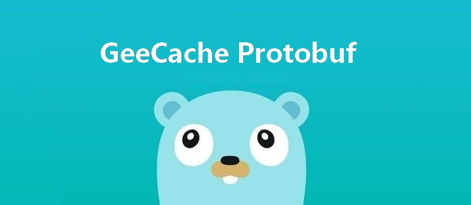

本文是[7天用Go从零实现分布式缓存GeeCache](https://geektutu.com/post/geecache.html)的第七篇。

- 为什么要使用 protobuf？
- 使用 protobuf 进行节点间通信，编码报文，提高效率。**代码约50行**

## 1 为什么要使用 protobuf

> protobuf 即 Protocol Buffers，Google 开发的一种数据描述语言，是一种轻便高效的结构化数据存储格式，与语言、平台无关，可扩展可序列化。protobuf 以二进制方式存储，占用空间小。

protobuf 的安装和使用教程请移步 [Go Protobuf 简明教程](https://geektutu.com/post/quick-go-protobuf.html)，这篇文章就不再赘述了。protobuf 广泛地应用于远程过程调用(RPC) 的二进制传输，使用 protobuf 的目的非常简单，为了获得更高的性能。传输前使用 protobuf 编码，接收方再进行解码，可以显著地降低二进制传输的大小。另外一方面，protobuf 可非常适合传输结构化数据，便于通信字段的扩展。

使用 protobuf 一般分为以下 2 步：

- 按照 protobuf 的语法，在 `.proto` 文件中定义数据结构，并使用 `protoc` 生成 Go 代码（`.proto` 文件是跨平台的，还可以生成 C、Java 等其他源码文件）。
- 在项目代码中引用生成的 Go 代码。

## 2 使用 protobuf 通信

新建 package `geecachepb`，定义 `geecachepb.proto`

[day7-proto-buf/geecache/geecachepb/geecachepb.proto - github](https://github.com/geektutu/7days-golang/tree/master/gee-cache/day7-proto-buf/geecache/geecachepb)

```go
syntax = "proto3";

package geecachepb;

message Request {
  string group = 1;
  string key = 2;
}

message Response {
  bytes value = 1;
}

service GroupCache {
  rpc Get(Request) returns (Response);
}
```

- `Request` 包含 2 个字段， group 和 cache，这与我们之前定义的接口 `/_geecache/<group>/<name>` 所需的参数吻合。
- `Response` 包含 1 个字段，bytes，类型为 byte 数组，与之前吻合。

生成 `geecache.pb.go`

```bash
$ protoc --go_out=. *.proto
$ ls
geecachepb.pb.go  geecachepb.proto
```

可以看到 `geecachepb.pb.go` 中有如下数据类型：

```go
type Request struct {
	Group string   `protobuf:"bytes,1,opt,name=group,proto3" json:"group,omitempty"`
    Key   string   `protobuf:"bytes,2,opt,name=key,proto3" json:"key,omitempty"`
    ...
}
type Response struct {
	Value []byte   `protobuf:"bytes,1,opt,name=value,proto3" json:"value,omitempty"`
}
```

接下来，修改 `peers.go` 中的 `PeerGetter` 接口，参数使用 `geecachepb.pb.go` 中的数据类型。

[day7-proto-buf/geecache/peers.go - github](https://github.com/geektutu/7days-golang/tree/master/gee-cache/day7-proto-buf/geecache)

```go
import pb "geecache/geecachepb"

type PeerGetter interface {
	Get(in *pb.Request, out *pb.Response) error
}
```

最后，修改 `geecache.go` 和 `http.go` 中使用了 `PeerGetter` 接口的地方。

[day7-proto-buf/geecache/geecache.go - github](https://github.com/geektutu/7days-golang/tree/master/gee-cache/day7-proto-buf/geecache)

```go
import (
    // ...
    pb "geecache/geecachepb"
)

func (g *Group) getFromPeer(peer PeerGetter, key string) (ByteView, error) {
	req := &pb.Request{
		Group: g.name,
		Key:   key,
	}
	res := &pb.Response{}
	err := peer.Get(req, res)
	if err != nil {
		return ByteView{}, err
	}
	return ByteView{b: res.Value}, nil
}
```

[day7-proto-buf/geecache/http.go - github](https://github.com/geektutu/7days-golang/tree/master/gee-cache/day7-proto-buf/geecache)

```go
import (
    // ...
	pb "geecache/geecachepb"
	"github.com/golang/protobuf/proto"
)

func (p *HTTPPool) ServeHTTP(w http.ResponseWriter, r *http.Request) {
    // ...
	// Write the value to the response body as a proto message.
	body, err := proto.Marshal(&pb.Response{Value: view.ByteSlice()})
	if err != nil {
		http.Error(w, err.Error(), http.StatusInternalServerError)
		return
	}
	w.Header().Set("Content-Type", "application/octet-stream")
	w.Write(body)
}

func (h *httpGetter) Get(in *pb.Request, out *pb.Response) error {
	u := fmt.Sprintf(
		"%v%v/%v",
		h.baseURL,
		url.QueryEscape(in.GetGroup()),
		url.QueryEscape(in.GetKey()),
	)
    res, err := http.Get(u)
	// ...
	if err = proto.Unmarshal(bytes, out); err != nil {
		return fmt.Errorf("decoding response body: %v", err)
	}

	return nil
}
```

- `ServeHTTP()` 中使用 `proto.Marshal()` 编码 HTTP 响应。
- `Get()` 中使用 `proto.Unmarshal()` 解码 HTTP 响应。

至此，我们已经将 HTTP 通信的中间载体替换成了 protobuf。运行 `run.sh` 即可以测试 GeeCache 能否正常工作。

## 总结

到这一篇为止，7 天用 Go 动手写/从零实现分布式缓存 GeeCache 这个系列就完成了。简单回顾下。第一天，为了解决资源限制的问题，实现了 LRU 缓存淘汰算法；第二天实现了单机并发，并给用户提供了自定义数据源的回调函数；第三天实现了 HTTP 服务端；第四天实现了一致性哈希算法，解决远程节点的挑选问题；第五天创建 HTTP 客户端，实现了多节点间的通信；第六天实现了 singleflight 解决缓存击穿的问题；第七天，使用 protobuf 库，优化了节点间通信的性能。如果看到这里，还没有动手写的话呢，赶紧动手写起来吧。一天差不多只需要实现 100 行代码呢。

## 附 推荐

- [Go 语言简明教程](https://geektutu.com/post/quick-golang.html)
- [Go Test 单元测试简明教程](https://geektutu.com/post/quick-go-test.html)
- [Go Protobuf 简明教程](https://geektutu.com/post/quick-go-protobuf.html)