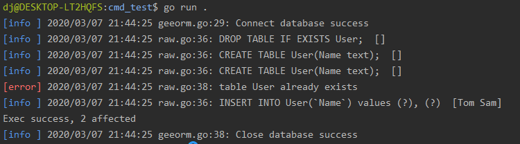

本文是[7天用Go从零实现ORM框架GeeORM](https://geektutu.com/post/geeorm.html)的第一篇。介绍了

- SQLite 的基础操作（连接数据库，创建表、增删记录等）。
- 使用 Go 语言标准库 database/sql 连接并操作 SQLite 数据库，并简单封装。**代码约150行**

## 1 初识 SQLite

> SQLite is a C-language library that implements a small, fast, self-contained, high-reliability, full-featured, SQL database engine.
> -- [SQLite 官网](https://sqlite.org/index.html)

SQLite 是一款轻量级的，遵守 ACID 事务原则的关系型数据库。SQLite 可以直接嵌入到代码中，不需要像 MySQL、PostgreSQL 需要启动独立的服务才能使用。SQLite 将数据存储在单一的磁盘文件中，使用起来非常方便。也非常适合初学者用来学习关系型数据的使用。GeeORM 的所有的开发和测试均基于 SQLite。

在 Ubuntu 上，安装 SQLite 只需要一行命令，无需配置即可使用。

```bash
apt-get install sqlite3
```

接下来，连接数据库(gee.db)，如若 gee.db 不存在，则会新建。如果连接成功，就进入到了 SQLite 的命令行模式，执行 `.help` 可以看到所有的帮助命令。

```bash
> sqlite3 gee.db
SQLite version 3.22.0 2018-01-22 18:45:57
Enter ".help" for usage hints.
sqlite>
```

使用 SQL 语句新建一张表 `User`，包含两个字段，字符串 Name 和 整型 Age。

```bash
sqlite> CREATE TABLE User(Name text, Age integer);
```

插入两条数据

```bash
sqlite> INSERT INTO User(Name, Age) VALUES ("Tom", 18), ("Jack", 25);
```

执行简单的查询操作，在执行之前使用 `.head on` 打开显示列名的开关，这样查询结果看上去更直观。

```bash
sqlite> .head on

# 查找 `Age > 20` 的记录；
sqlite> SELECT * FROM User WHERE Age > 20;
Name|Age
Jack|25

# 统计记录个数。
sqlite> SELECT COUNT(*) FROM User;
COUNT(*)
2
```

使用 `.table` 查看当前数据库中所有的表(table)，执行 `.schema <table>` 查看建表的 SQL 语句。

```bash
sqlite> .table
User

sqlite> .schema User
CREATE TABLE User(Name text, Age integer);
```

SQLite 的使用暂时介绍这么多，了解了以上使用方法已经足够我们完成今天的任务了。如果想了解更多用法，可参考 [SQLite 常用命令](https://geektutu.com/post/cheat-sheet-sqlite.html)。


## 2 database/sql 标准库

Go 语言提供了标准库 `database/sql` 用于和数据库的交互，接下来我们写一个 Demo，看一看这个库的用法。

```go
package main

import (
	"database/sql"
	"log"
	
	_ "github.com/mattn/go-sqlite3"
)

func main() {
	db, _ := sql.Open("sqlite3", "gee.db")
	defer func() { _ = db.Close() }()
	_, _ = db.Exec("DROP TABLE IF EXISTS User;")
	_, _ = db.Exec("CREATE TABLE User(Name text);")
	result, err := db.Exec("INSERT INTO User(`Name`) values (?), (?)", "Tom", "Sam")
	if err == nil {
		affected, _ := result.RowsAffected()
		log.Println(affected)
	}
	row := db.QueryRow("SELECT Name FROM User LIMIT 1")
	var name string
	if err := row.Scan(&name); err == nil {
		log.Println(name)
	}
}
```

> go-sqlite3 依赖于 gcc，如果这份代码在 Windows 上运行的话，需要安装 [mingw](http://mingw.org/) 或其他包含有 gcc 编译器的工具包。

执行 `go run .`，输出如下。

```bash
> go run .
2020/03/07 20:28:37 2
2020/03/07 20:28:37 Tom
```

- 使用 `sql.Open()` 连接数据库，第一个参数是驱动名称，import 语句 `_ "github.com/mattn/go-sqlite3"` 包导入时会注册 sqlite3 的驱动，第二个参数是数据库的名称，对于 SQLite 来说，也就是文件名，不存在会新建。返回一个 `sql.DB` 实例的指针。
- `Exec()` 用于执行 SQL 语句，如果是查询语句，不会返回相关的记录。所以查询语句通常使用 `Query()` 和 `QueryRow()`，前者可以返回多条记录，后者只返回一条记录。
- `Exec()`、`Query()`、`QueryRow()` 接受1或多个入参，第一个入参是 SQL 语句，后面的入参是 SQL 语句中的占位符 `?` 对应的值，占位符一般用来防 SQL 注入。
- `QueryRow()` 的返回值类型是 `*sql.Row`，`row.Scan()` 接受1或多个指针作为参数，可以获取对应列(column)的值，在这个示例中，只有 `Name` 一列，因此传入字符串指针 `&name` 即可获取到查询的结果。


掌握了基础的 SQL 语句和 Go 标准库 `database/sql` 的使用，可以开始实现 ORM 框架的雏形了。

## 3 实现一个简单的 log 库

开发一个框架/库并不容易，详细的日志能够帮助我们快速地定位问题。因此，在写核心代码之前，我们先用几十行代码实现一个简单的 log 库。

> 为什么不直接使用原生的 log 库呢？log 标准库没有日志分级，不打印文件和行号，这就意味着我们很难快速知道是哪个地方发生了错误。

这个简易的 log 库具备以下特性：

- 支持日志分级（Info、Error、Disabled 三级）。
- 不同层级日志显示时使用不同的颜色区分。
- 显示打印日志代码对应的文件名和行号。

```bash
go mod init geeorm
```

首先创建一个名为 geeorm 的 module，并新建文件 log/log.go，用于放置和日志相关的代码。GeeORM 现在长这个样子：

```bash
day1-database-sql/
    |--log/
        |--log.go
    |--go.mod
```

第一步，创建 2 个日志实例分别用于打印 Info 和 Error 日志。

[day1-database-sql/log/log.go](https://github.com/geektutu/7days-golang/tree/master/gee-orm/day1-database-sql/log)

```go
package log

import (
	"io/ioutil"
	"log"
	"os"
	"sync"
)

var (
	errorLog = log.New(os.Stdout, "\033[31m[error]\033[0m ", log.LstdFlags|log.Lshortfile)
	infoLog  = log.New(os.Stdout, "\033[34m[info ]\033[0m ", log.LstdFlags|log.Lshortfile)
	loggers  = []*log.Logger{errorLog, infoLog}
	mu       sync.Mutex
)

// log methods
var (
	Error  = errorLog.Println
	Errorf = errorLog.Printf
	Info   = infoLog.Println
	Infof  = infoLog.Printf
)
```

- `[info ]` 颜色为蓝色，`[error]` 为红色。
- 使用 `log.Lshortfile` 支持显示文件名和代码行号。
- 暴露 `Error`，`Errorf`，`Info`，`Infof` 4个方法。

第二步呢，支持设置日志的层级(InfoLevel, ErrorLevel, Disabled)。

```go
// log levels
const (
	InfoLevel = iota
	ErrorLevel
	Disabled
)

// SetLevel controls log level
func SetLevel(level int) {
	mu.Lock()
	defer mu.Unlock()

	for _, logger := range loggers {
		logger.SetOutput(os.Stdout)
	}

	if ErrorLevel < level {
		errorLog.SetOutput(ioutil.Discard)
	}
	if InfoLevel < level {
		infoLog.SetOutput(ioutil.Discard)
	}
}
```

- 这一部分的实现非常简单，三个层级声明为三个常量，通过控制 `Output`，来控制日志是否打印。
- 如果设置为 ErrorLevel，infoLog 的输出会被定向到 `ioutil.Discard`，即不打印该日志。

至此呢，一个简单的支持分级的 log 库就实现完成了。

## 4 核心结构 Session

我们在根目录下新建一个文件夹 session，用于实现与数据库的交互。今天我们只实现直接调用 SQL 语句进行原生交互的部分，这部分代码实现在 `session/raw.go` 中。

[day1-database-sql/session/raw.go](https://github.com/geektutu/7days-golang/tree/master/gee-orm/day1-database-sql/session)

```go
package session

import (
	"database/sql"
	"geeorm/log"
	"strings"
)

type Session struct {
	db      *sql.DB
	sql     strings.Builder
	sqlVars []interface{}
}

func New(db *sql.DB) *Session {
	return &Session{db: db}
}

func (s *Session) Clear() {
	s.sql.Reset()
	s.sqlVars = nil
}

func (s *Session) DB() *sql.DB {
	return s.db
}

func (s *Session) Raw(sql string, values ...interface{}) *Session {
	s.sql.WriteString(sql)
	s.sql.WriteString(" ")
	s.sqlVars = append(s.sqlVars, values...)
	return s
}
```

- Session 结构体目前只包含三个成员变量，第一个是 `db *sql.DB`，即使用 `sql.Open()` 方法连接数据库成功之后返回的指针。
- 第二个和第三个成员变量用来拼接 SQL 语句和 SQL 语句中占位符的对应值。用户调用 `Raw()` 方法即可改变这两个变量的值。

接下来呢，封装 `Exec()`、`Query()` 和 `QueryRow()` 三个原生方法。

```go
// Exec raw sql with sqlVars
func (s *Session) Exec() (result sql.Result, err error) {
	defer s.Clear()
	log.Info(s.sql.String(), s.sqlVars)
	if result, err = s.DB().Exec(s.sql.String(), s.sqlVars...); err != nil {
		log.Error(err)
	}
	return
}

// QueryRow gets a record from db
func (s *Session) QueryRow() *sql.Row {
	defer s.Clear()
	log.Info(s.sql.String(), s.sqlVars)
	return s.DB().QueryRow(s.sql.String(), s.sqlVars...)
}

// QueryRows gets a list of records from db
func (s *Session) QueryRows() (rows *sql.Rows, err error) {
	defer s.Clear()
	log.Info(s.sql.String(), s.sqlVars)
	if rows, err = s.DB().Query(s.sql.String(), s.sqlVars...); err != nil {
		log.Error(err)
	}
	return
}
```

- 封装有 2 个目的，一是统一打印日志（包括 执行的SQL 语句和错误日志）。
- 二是执行完成后，清空 `(s *Session).sql` 和 `(s *Session).sqlVars` 两个变量。这样 Session 可以复用，开启一次会话，可以执行多次 SQL。

## 5 核心结构 Engine

Session 负责与数据库的交互，那交互前的准备工作（比如连接/测试数据库），交互后的收尾工作（关闭连接）等就交给 Engine 来负责了。Engine 是 GeeORM 与用户交互的入口。代码位于根目录的 `geeorm.go`。

[day1-database-sql/geeorm.go](https://github.com/geektutu/7days-golang/tree/master/gee-orm/day1-database-sql)

```go
package geeorm

import (
	"database/sql"

	"geeorm/log"
	"geeorm/session"
)

type Engine struct {
	db *sql.DB
}

func NewEngine(driver, source string) (e *Engine, err error) {
	db, err := sql.Open(driver, source)
	if err != nil {
		log.Error(err)
		return
	}
	// Send a ping to make sure the database connection is alive.
	if err = db.Ping(); err != nil {
		log.Error(err)
		return
	}
	e = &Engine{db: db}
	log.Info("Connect database success")
	return
}

func (engine *Engine) Close() {
	if err := engine.db.Close(); err != nil {
		log.Error("Failed to close database")
	}
	log.Info("Close database success")
}

func (engine *Engine) NewSession() *session.Session {
	return session.New(engine.db)
}
```

Engine 的逻辑非常简单，最重要的方法是 `NewEngine`，`NewEngine` 主要做了两件事。

- 连接数据库，返回 `*sql.DB`。
- 调用 `db.Ping()`，检查数据库是否能够正常连接。

另外呢，提供了 Engine 提供了 `NewSession()` 方法，这样可以通过 `Engine` 实例创建会话，进而与数据库进行交互了。到这一步，整个 GeeORM 的框架雏形已经出来了。

```bash
day1-database-sql/
    |--log/          # 日志
        |--log.go
    |--session/      # 数据库交互
        |--raw.go
    |--geeorm.go     # 用户交互
    |--go.mod 
```

## 6 测试

GeeORM 的单元测试是比较完备的，可以参考 `log_test.go`、`raw_test.go` 和 `geeorm_test.go` 等几个测试文件，在这里呢，就不一一讲解了。接下来呢，我们将 geeorm 视为第三方库来使用。

在根目录下新建 cmd_test 目录放置测试代码，新建文件 main.go。

[day1-database-sql/cmd_test/main.go](https://github.com/geektutu/7days-golang/tree/master/gee-orm/day1-database-sql/cmd_test)

```go
package main

import (
	"geeorm"
	"geeorm/log"

	_ "github.com/mattn/go-sqlite3"
)

func main() {
	engine, _ := geeorm.NewEngine("sqlite3", "gee.db")
	defer engine.Close()
	s := engine.NewSession()
	_, _ = s.Raw("DROP TABLE IF EXISTS User;").Exec()
    _, _ = s.Raw("CREATE TABLE User(Name text);").Exec()
    _, _ = s.Raw("CREATE TABLE User(Name text);").Exec()
	result, _ := s.Raw("INSERT INTO User(`Name`) values (?), (?)", "Tom", "Sam").Exec()
	count, _ := result.RowsAffected()
	fmt.Printf("Exec success, %d affected\n", count)
}
```

执行 `go run main.go`，将会看到如下的输出：



日志中出现了一行报错信息，*table User already exists*，因为我们在 main 函数中执行了两次创建表 `User` 的语句。可以看到，每一行日志均标明了报错的文件和行号，而且不同层级日志的颜色是不同的。

## 附 推荐阅读

- [Go 语言简明教程](https://geektutu.com/post/quick-golang.html)
- [Go Test 单元测试简明教程](https://geektutu.com/post/quick-go-test.html)
- [SQLite 常用命令速查表](https://geektutu.com/post/cheat-sheet-sqlite.html)