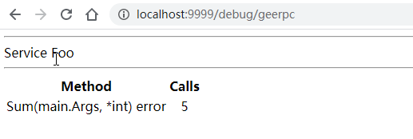

本文是[7天用Go从零实现RPC框架GeeRPC](https://geektutu.com/post/geerpc.html)的第五篇。

- 支持 HTTP 协议
- 基于 HTTP 实现一个简单的 Debug 页面，代码约 150 行。

## 支持 HTTP 协议需要做什么？

Web 开发中，我们经常使用 HTTP 协议中的 HEAD、GET、POST 等方式发送请求，等待响应。但 RPC 的消息格式与标准的 HTTP 协议并不兼容，在这种情况下，就需要一个协议的转换过程。HTTP 协议的 CONNECT 方法恰好提供了这个能力，CONNECT 一般用于代理服务。

假设浏览器与服务器之间的 HTTPS 通信都是加密的，浏览器通过代理服务器发起 HTTPS 请求时，由于请求的站点地址和端口号都是加密保存在 HTTPS 请求报文头中的，代理服务器如何知道往哪里发送请求呢？为了解决这个问题，浏览器通过 HTTP 明文形式向代理服务器发送一个 CONNECT 请求告诉代理服务器目标地址和端口，代理服务器接收到这个请求后，会在对应端口与目标站点建立一个 TCP 连接，连接建立成功后返回 HTTP 200 状态码告诉浏览器与该站点的加密通道已经完成。接下来代理服务器仅需透传浏览器和服务器之间的加密数据包即可，代理服务器无需解析 HTTPS 报文。

举一个简单例子：

1) 浏览器向代理服务器发送 CONNECT 请求。

```bash
CONNECT geektutu.com:443 HTTP/1.0
```

2) 代理服务器返回 HTTP 200 状态码表示连接已经建立。

```bash
HTTP/1.0 200 Connection Established
```

3) 之后浏览器和服务器开始 HTTPS 握手并交换加密数据，代理服务器只负责传输彼此的数据包，并不能读取具体数据内容（代理服务器也可以选择安装可信根证书解密 HTTPS 报文）。

事实上，这个过程其实是通过代理服务器将 HTTP 协议转换为 HTTPS 协议的过程。对 RPC 服务端来，需要做的是将 HTTP 协议转换为 RPC 协议，对客户端来说，需要新增通过 HTTP CONNECT 请求创建连接的逻辑。


## 服务端支持 HTTP 协议

那通信过程应该是这样的：

1) 客户端向 RPC 服务器发送 CONNECT 请求

```bash
CONNECT 10.0.0.1:9999/_geerpc_ HTTP/1.0
```

2) RPC 服务器返回 HTTP 200 状态码表示连接建立。

```bash
HTTP/1.0 200 Connected to Gee RPC
```

3) 客户端使用创建好的连接发送 RPC 报文，先发送 Option，再发送 N 个请求报文，服务端处理 RPC 请求并响应。

在 `server.go` 中新增如下的方法：

[day5-http-debug/server.go](https://github.com/geektutu/7days-golang/tree/master/gee-rpc/day5-http-debug)

```go
const (
	connected        = "200 Connected to Gee RPC"
	defaultRPCPath   = "/_geeprc_"
	defaultDebugPath = "/debug/geerpc"
)

// ServeHTTP implements an http.Handler that answers RPC requests.
func (server *Server) ServeHTTP(w http.ResponseWriter, req *http.Request) {
	if req.Method != "CONNECT" {
		w.Header().Set("Content-Type", "text/plain; charset=utf-8")
		w.WriteHeader(http.StatusMethodNotAllowed)
		_, _ = io.WriteString(w, "405 must CONNECT\n")
		return
	}
	conn, _, err := w.(http.Hijacker).Hijack()
	if err != nil {
		log.Print("rpc hijacking ", req.RemoteAddr, ": ", err.Error())
		return
	}
	_, _ = io.WriteString(conn, "HTTP/1.0 "+connected+"\n\n")
	server.ServeConn(conn)
}

// HandleHTTP registers an HTTP handler for RPC messages on rpcPath.
// It is still necessary to invoke http.Serve(), typically in a go statement.
func (server *Server) HandleHTTP() {
	http.Handle(defaultRPCPath, server)
}

// HandleHTTP is a convenient approach for default server to register HTTP handlers
func HandleHTTP() {
	DefaultServer.HandleHTTP()
}
```

`defaultDebugPath` 是为后续 DEBUG 页面预留的地址。

在 Go 语言中处理 HTTP 请求是非常简单的一件事，Go 标准库中 `http.Handle` 的实现如下：

```go
package http
// Handle registers the handler for the given pattern
// in the DefaultServeMux.
// The documentation for ServeMux explains how patterns are matched.
func Handle(pattern string, handler Handler) { DefaultServeMux.Handle(pattern, handler) }
```

第一个参数是支持通配的字符串 pattern，在这里，我们固定传入 `/_geeprc_`，第二个参数是 Handler 类型，Handler 是一个接口类型，定义如下：

```go
type Handler interface {
    ServeHTTP(w ResponseWriter, r *Request)
}
```

也就是说，只需要实现接口 Handler 即可作为一个 HTTP Handler 处理 HTTP 请求。接口 Handler 只定义了一个方法 `ServeHTTP`，实现该方法即可。

> 关于 http.Handler 的更多信息，推荐阅读 [Go语言动手写Web框架 - Gee第一天 http.Handler](https://geektutu.com/post/gee-day1.html)

## 客户端支持 HTTP 协议

服务端已经能够接受 CONNECT 请求，并返回了 200 状态码 `HTTP/1.0 200 Connected to Gee RPC`，客户端要做的，发起 CONNECT 请求，检查返回状态码即可成功建立连接。

[day5-http-debug/client.go](https://github.com/geektutu/7days-golang/tree/master/gee-rpc/day5-http-debug)

```go
// NewHTTPClient new a Client instance via HTTP as transport protocol
func NewHTTPClient(conn net.Conn, opt *Option) (*Client, error) {
	_, _ = io.WriteString(conn, fmt.Sprintf("CONNECT %s HTTP/1.0\n\n", defaultRPCPath))

	// Require successful HTTP response
	// before switching to RPC protocol.
	resp, err := http.ReadResponse(bufio.NewReader(conn), &http.Request{Method: "CONNECT"})
	if err == nil && resp.Status == connected {
		return NewClient(conn, opt)
	}
	if err == nil {
		err = errors.New("unexpected HTTP response: " + resp.Status)
	}
	return nil, err
}

// DialHTTP connects to an HTTP RPC server at the specified network address
// listening on the default HTTP RPC path.
func DialHTTP(network, address string, opts ...*Option) (*Client, error) {
	return dialTimeout(NewHTTPClient, network, address, opts...)
}
```

通过 HTTP CONNECT 请求建立连接之后，后续的通信过程就交给 NewClient 了。

为了简化调用，提供了一个统一入口 `XDial`

```go
// XDial calls different functions to connect to a RPC server
// according the first parameter rpcAddr.
// rpcAddr is a general format (protocol@addr) to represent a rpc server
// eg, http@10.0.0.1:7001, tcp@10.0.0.1:9999, unix@/tmp/geerpc.sock
func XDial(rpcAddr string, opts ...*Option) (*Client, error) {
	parts := strings.Split(rpcAddr, "@")
	if len(parts) != 2 {
		return nil, fmt.Errorf("rpc client err: wrong format '%s', expect protocol@addr", rpcAddr)
	}
	protocol, addr := parts[0], parts[1]
	switch protocol {
	case "http":
		return DialHTTP("tcp", addr, opts...)
	default:
		// tcp, unix or other transport protocol
		return Dial(protocol, addr, opts...)
	}
}
```

添加一个测试用例试一试，这个测试用例使用了 unix 协议创建 socket 连接，适用于本机内部的通信，使用上与 TCP 协议并无区别。

[day5-http-debug/client_test.go](https://github.com/geektutu/7days-golang/tree/master/gee-rpc/day5-http-debug)

```go
func TestXDial(t *testing.T) {
	if runtime.GOOS == "linux" {
		ch := make(chan struct{})
		addr := "/tmp/geerpc.sock"
		go func() {
			_ = os.Remove(addr)
			l, err := net.Listen("unix", addr)
			if err != nil {
				t.Fatal("failed to listen unix socket")
			}
			ch <- struct{}{}
			Accept(l)
		}()
		<-ch
		_, err := XDial("unix@" + addr)
		_assert(err == nil, "failed to connect unix socket")
	}
}
```


## 实现简单的 DEBUG 页面

支持 HTTP 协议的好处在于，RPC 服务仅仅使用了监听端口的 `/_geerpc` 路径，在其他路径上我们可以提供诸如日志、统计等更为丰富的功能。接下来我们在 `/debug/geerpc` 上展示服务的调用统计视图。

[day5-http-debug/debug.go](https://github.com/geektutu/7days-golang/tree/master/gee-rpc/day5-http-debug)

```go
package geerpc

import (
	"fmt"
	"html/template"
	"net/http"
)

const debugText = `<html>
	<body>
	<title>GeeRPC Services</title>
	{{range .}}
	<hr>
	Service {{.Name}}
	<hr>
		<table>
		<th align=center>Method</th><th align=center>Calls</th>
		{{range $name, $mtype := .Method}}
			<tr>
			<td align=left font=fixed>{{$name}}({{$mtype.ArgType}}, {{$mtype.ReplyType}}) error</td>
			<td align=center>{{$mtype.NumCalls}}</td>
			</tr>
		{{end}}
		</table>
	{{end}}
	</body>
	</html>`

var debug = template.Must(template.New("RPC debug").Parse(debugText))

type debugHTTP struct {
	*Server
}

type debugService struct {
	Name   string
	Method map[string]*methodType
}

// Runs at /debug/geerpc
func (server debugHTTP) ServeHTTP(w http.ResponseWriter, req *http.Request) {
	// Build a sorted version of the data.
	var services []debugService
	server.serviceMap.Range(func(namei, svci interface{}) bool {
		svc := svci.(*service)
		services = append(services, debugService{
			Name:   namei.(string),
			Method: svc.method,
		})
		return true
	})
	err := debug.Execute(w, services)
	if err != nil {
		_, _ = fmt.Fprintln(w, "rpc: error executing template:", err.Error())
	}
}
```

在这里，我们将返回一个 HTML 报文，这个报文将展示注册所有的 service 的每一个方法的调用情况。

将 debugHTTP 实例绑定到地址 `/debug/geerpc`。

```go
func (server *Server) HandleHTTP() {
	http.Handle(defaultRPCPath, server)
	http.Handle(defaultDebugPath, debugHTTP{server})
	log.Println("rpc server debug path:", defaultDebugPath)
}
```

## Demo

OK，我们已经迫不及待地想看看最终的效果了。

[day5-http-debug/main/main.go](https://github.com/geektutu/7days-golang/tree/master/gee-rpc/day5-http-debug)

和之前的例子相比较，将 startServer 中的 `geerpc.Accept()` 替换为了 `geerpc.HandleHTTP()`，端口固定为 9999。

```go
type Foo int

type Args struct{ Num1, Num2 int }

func (f Foo) Sum(args Args, reply *int) error {
	*reply = args.Num1 + args.Num2
	return nil
}

func startServer(addrCh chan string) {
	var foo Foo
	l, _ := net.Listen("tcp", ":9999")
	_ = geerpc.Register(&foo)
	geerpc.HandleHTTP()
	addrCh <- l.Addr().String()
	_ = http.Serve(l, nil)
}
```

客户端将 `Dial` 替换为 `DialHTTP`，其余地方没有发生改变。

```go
func call(addrCh chan string) {
	client, _ := geerpc.DialHTTP("tcp", <-addrCh)
	defer func() { _ = client.Close() }()

	time.Sleep(time.Second)
	// send request & receive response
	var wg sync.WaitGroup
	for i := 0; i < 5; i++ {
		wg.Add(1)
		go func(i int) {
			defer wg.Done()
			args := &Args{Num1: i, Num2: i * i}
			var reply int
			if err := client.Call(context.Background(), "Foo.Sum", args, &reply); err != nil {
				log.Fatal("call Foo.Sum error:", err)
			}
			log.Printf("%d + %d = %d", args.Num1, args.Num2, reply)
		}(i)
	}
	wg.Wait()
}

func main() {
	log.SetFlags(0)
	ch := make(chan string)
	go call(ch)
	startServer(ch)
}
```

main 函数中，我们在最后调用 `startServer`，服务启动后将一直等待。

运行结果如下：

```bash
main$ go run .
rpc server: register Foo.Sum
rpc server debug path: /debug/geerpc
3 + 9 = 12
2 + 4 = 6
4 + 16 = 20
0 + 0 = 0
1 + 1 = 2
```

服务已经启动，此时我们如果在浏览器中访问 `localhost:9999/debug/geerpc`，将会看到：



## 附 推荐阅读

- [Go 语言简明教程](https://geektutu.com/post/quick-golang.html)
- [Go 语言笔试面试题](https://geektutu.com/post/qa-golang.html)