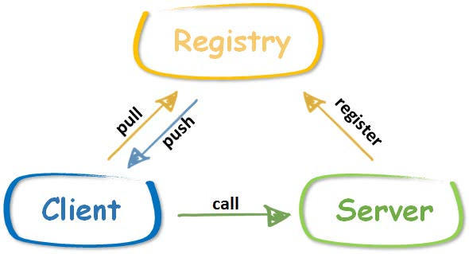

本文是[7天用Go从零实现RPC框架GeeRPC](https://geektutu.com/post/geerpc.html)的第七篇。

- 实现一个简单的注册中心，支持服务注册、接收心跳等功能
- 客户端实现基于注册中心的服务发现机制，代码约 250 行

## 注册中心的位置



注册中心的位置如上图所示。注册中心的好处在于，客户端和服务端都只需要感知注册中心的存在，而无需感知对方的存在。更具体一些：

1) 服务端启动后，向注册中心发送注册消息，注册中心得知该服务已经启动，处于可用状态。一般来说，服务端还需要定期向注册中心发送心跳，证明自己还活着。
2) 客户端向注册中心询问，当前哪天服务是可用的，注册中心将可用的服务列表返回客户端。
3) 客户端根据注册中心得到的服务列表，选择其中一个发起调用。

如果没有注册中心，就像 GeeRPC 第六天实现的一样，客户端需要硬编码服务端的地址，而且没有机制保证服务端是否处于可用状态。当然注册中心的功能还有很多，比如配置的动态同步、通知机制等。比较常用的注册中心有 [etcd](https://github.com/etcd-io/etcd)、[zookeeper](https://github.com/apache/zookeeper)、[consul](https://github.com/hashicorp/consul)，一般比较出名的微服务或者 RPC 框架，这些主流的注册中心都是支持的。


## Gee Registry

主流的注册中心 etcd、zookeeper 等功能强大，与这类注册中心的对接代码量是比较大的，需要实现的接口很多。GeeRPC 选择自己实现一个简单的支持心跳保活的注册中心。

GeeRegistry 的代码独立放置在子目录 registry 中。

首先定义 GeeRegistry 结构体，默认超时时间设置为 5 min，也就是说，任何注册的服务超过 5 min，即视为不可用状态。

[day7-registry/registry/registry.go](https://github.com/geektutu/7days-golang/tree/master/gee-rpc/day7-registry)

```go
// GeeRegistry is a simple register center, provide following functions.
// add a server and receive heartbeat to keep it alive.
// returns all alive servers and delete dead servers sync simultaneously.
type GeeRegistry struct {
	timeout time.Duration
	mu      sync.Mutex // protect following
	servers map[string]*ServerItem
}

type ServerItem struct {
	Addr  string
	start time.Time
}

const (
	defaultPath    = "/_geerpc_/registry"
	defaultTimeout = time.Minute * 5
)

// New create a registry instance with timeout setting
func New(timeout time.Duration) *GeeRegistry {
	return &GeeRegistry{
		servers: make(map[string]*ServerItem),
		timeout: timeout,
	}
}

var DefaultGeeRegister = New(defaultTimeout)
```

为 GeeRegistry 实现添加服务实例和返回服务列表的方法。

- putServer：添加服务实例，如果服务已经存在，则更新 start。
- aliveServers：返回可用的服务列表，如果存在超时的服务，则删除。

```go
func (r *GeeRegistry) putServer(addr string) {
	r.mu.Lock()
	defer r.mu.Unlock()
	s := r.servers[addr]
	if s == nil {
		r.servers[addr] = &ServerItem{Addr: addr, start: time.Now()}
	} else {
		s.start = time.Now() // if exists, update start time to keep alive
	}
}

func (r *GeeRegistry) aliveServers() []string {
	r.mu.Lock()
	defer r.mu.Unlock()
	var alive []string
	for addr, s := range r.servers {
		if r.timeout == 0 || s.start.Add(r.timeout).After(time.Now()) {
			alive = append(alive, addr)
		} else {
			delete(r.servers, addr)
		}
	}
	sort.Strings(alive)
	return alive
}
```

为了实现上的简单，GeeRegistry 采用 HTTP 协议提供服务，且所有的有用信息都承载在 HTTP Header 中。

- Get：返回所有可用的服务列表，通过自定义字段 X-Geerpc-Servers 承载。
- Post：添加服务实例或发送心跳，通过自定义字段 X-Geerpc-Server 承载。

```go
// Runs at /_geerpc_/registry
func (r *GeeRegistry) ServeHTTP(w http.ResponseWriter, req *http.Request) {
	switch req.Method {
	case "GET":
		// keep it simple, server is in req.Header
		w.Header().Set("X-Geerpc-Servers", strings.Join(r.aliveServers(), ","))
	case "POST":
		// keep it simple, server is in req.Header
		addr := req.Header.Get("X-Geerpc-Server")
		if addr == "" {
			w.WriteHeader(http.StatusInternalServerError)
			return
		}
		r.putServer(addr)
	default:
		w.WriteHeader(http.StatusMethodNotAllowed)
	}
}

// HandleHTTP registers an HTTP handler for GeeRegistry messages on registryPath
func (r *GeeRegistry) HandleHTTP(registryPath string) {
	http.Handle(registryPath, r)
	log.Println("rpc registry path:", registryPath)
}

func HandleHTTP() {
	DefaultGeeRegister.HandleHTTP(defaultPath)
}
```

另外，提供 Heartbeat 方法，便于服务启动时定时向注册中心发送心跳，默认周期比注册中心设置的过期时间少 1 min。

```go
// Heartbeat send a heartbeat message every once in a while
// it's a helper function for a server to register or send heartbeat
func Heartbeat(registry, addr string, duration time.Duration) {
	if duration == 0 {
		// make sure there is enough time to send heart beat
		// before it's removed from registry
		duration = defaultTimeout - time.Duration(1)*time.Minute
	}
	var err error
	err = sendHeartbeat(registry, addr)
	go func() {
		t := time.NewTicker(duration)
		for err == nil {
			<-t.C
			err = sendHeartbeat(registry, addr)
		}
	}()
}

func sendHeartbeat(registry, addr string) error {
	log.Println(addr, "send heart beat to registry", registry)
	httpClient := &http.Client{}
	req, _ := http.NewRequest("POST", registry, nil)
	req.Header.Set("X-Geerpc-Server", addr)
	if _, err := httpClient.Do(req); err != nil {
		log.Println("rpc server: heart beat err:", err)
		return err
	}
	return nil
}
```

## GeeRegistryDiscovery

在 xclient 中对应实现 Discovery。

[day7-registry/xclient/discovery_gee.go](https://github.com/geektutu/7days-golang/tree/master/gee-rpc/day7-registry)

```go
package xclient

type GeeRegistryDiscovery struct {
	*MultiServersDiscovery
	registry   string
	timeout    time.Duration
	lastUpdate time.Time
}

const defaultUpdateTimeout = time.Second * 10

func NewGeeRegistryDiscovery(registerAddr string, timeout time.Duration) *GeeRegistryDiscovery {
	if timeout == 0 {
		timeout = defaultUpdateTimeout
	}
	d := &GeeRegistryDiscovery{
		MultiServersDiscovery: NewMultiServerDiscovery(make([]string, 0)),
		registry:              registerAddr,
		timeout:               timeout,
	}
	return d
}
```

- GeeRegistryDiscovery 嵌套了 MultiServersDiscovery，很多能力可以复用。
- registry 即注册中心的地址
- timeout 服务列表的过期时间
- lastUpdate 是代表最后从注册中心更新服务列表的时间，默认 10s 过期，即 10s 之后，需要从注册中心更新新的列表。

实现 Update 和 Refresh 方法，超时重新获取的逻辑在 Refresh 中实现：

```go
func (d *GeeRegistryDiscovery) Update(servers []string) error {
	d.mu.Lock()
	defer d.mu.Unlock()
	d.servers = servers
	d.lastUpdate = time.Now()
	return nil
}

func (d *GeeRegistryDiscovery) Refresh() error {
	d.mu.Lock()
	defer d.mu.Unlock()
	if d.lastUpdate.Add(d.timeout).After(time.Now()) {
		return nil
	}
	log.Println("rpc registry: refresh servers from registry", d.registry)
	resp, err := http.Get(d.registry)
	if err != nil {
		log.Println("rpc registry refresh err:", err)
		return err
	}
	servers := strings.Split(resp.Header.Get("X-Geerpc-Servers"), ",")
	d.servers = make([]string, 0, len(servers))
	for _, server := range servers {
		if strings.TrimSpace(server) != "" {
			d.servers = append(d.servers, strings.TrimSpace(server))
		}
	}
	d.lastUpdate = time.Now()
	return nil
}
```

`Get` 和 `GetAll` 与 MultiServersDiscovery 相似，唯一的不同在于，GeeRegistryDiscovery 需要先调用 Refresh 确保服务列表没有过期。

```go
func (d *GeeRegistryDiscovery) Get(mode SelectMode) (string, error) {
	if err := d.Refresh(); err != nil {
		return "", err
	}
	return d.MultiServersDiscovery.Get(mode)
}

func (d *GeeRegistryDiscovery) GetAll() ([]string, error) {
	if err := d.Refresh(); err != nil {
		return nil, err
	}
	return d.MultiServersDiscovery.GetAll()
}
```

## Demo

最后，依旧通过简单的 Demo 验证今天的成果。

添加函数 startRegistry，稍微修改 startServer，添加调用注册中心的 `Heartbeat` 方法的逻辑，定期向注册中心发送心跳保活。

[day7-registry/main/main.go](https://github.com/geektutu/7days-golang/tree/master/gee-rpc/day7-registry)

```go
func startRegistry(wg *sync.WaitGroup) {
	l, _ := net.Listen("tcp", ":9999")
	registry.HandleHTTP()
	wg.Done()
	_ = http.Serve(l, nil)
}

func startServer(registryAddr string, wg *sync.WaitGroup) {
	var foo Foo
	l, _ := net.Listen("tcp", ":0")
	server := geerpc.NewServer()
	_ = server.Register(&foo)
	registry.Heartbeat(registryAddr, "tcp@"+l.Addr().String(), 0)
	wg.Done()
	server.Accept(l)
}
```

接下来，将 call 和 broadcast 的 MultiServersDiscovery 替换为 GeeRegistryDiscovery，不再需要硬编码服务列表。

```go
func call(registry string) {
	d := xclient.NewGeeRegistryDiscovery(registry, 0)
	xc := xclient.NewXClient(d, xclient.RandomSelect, nil)
	defer func() { _ = xc.Close() }()
	// send request & receive response
	var wg sync.WaitGroup
	for i := 0; i < 5; i++ {
		wg.Add(1)
		go func(i int) {
			defer wg.Done()
			foo(xc, context.Background(), "call", "Foo.Sum", &Args{Num1: i, Num2: i * i})
		}(i)
	}
	wg.Wait()
}

func broadcast(registry string) {
	d := xclient.NewGeeRegistryDiscovery(registry, 0)
	xc := xclient.NewXClient(d, xclient.RandomSelect, nil)
	defer func() { _ = xc.Close() }()
	var wg sync.WaitGroup
	for i := 0; i < 5; i++ {
		wg.Add(1)
		go func(i int) {
			defer wg.Done()
			foo(xc, context.Background(), "broadcast", "Foo.Sum", &Args{Num1: i, Num2: i * i})
			// expect 2 - 5 timeout
			ctx, _ := context.WithTimeout(context.Background(), time.Second*2)
			foo(xc, ctx, "broadcast", "Foo.Sleep", &Args{Num1: i, Num2: i * i})
		}(i)
	}
	wg.Wait()
}
```

最后在 main 函数中，将所有的逻辑串联起来，确保注册中心启动后，再启动 RPC 服务端，最后客户端远程调用。

```go
func main() {
	log.SetFlags(0)
	registryAddr := "http://localhost:9999/_geerpc_/registry"
	var wg sync.WaitGroup
	wg.Add(1)
	go startRegistry(&wg)
	wg.Wait()

	time.Sleep(time.Second)
	wg.Add(2)
	go startServer(registryAddr, &wg)
	go startServer(registryAddr, &wg)
	wg.Wait()

	time.Sleep(time.Second)
	call(registryAddr)
	broadcast(registryAddr)
}
```

运行结果如下：

```go
rpc registry path: /_geerpc_/registry
rpc server: register Foo.Sleep
rpc server: register Foo.Sum
tcp@[::]:56276 send heart beat to registry http://localhost:9999/_geerpc_/registry
rpc server: register Foo.Sleep
rpc server: register Foo.Sum
tcp@[::]:56277 send heart beat to registry http://localhost:9999/_geerpc_/registry
rpc registry: refresh servers from registry http://localhost:9999/_geerpc_/registry
call Foo.Sum success: 3 + 9 = 12
call Foo.Sum success: 4 + 16 = 20
call Foo.Sum success: 1 + 1 = 2
call Foo.Sum success: 0 + 0 = 0
call Foo.Sum success: 2 + 4 = 6
rpc registry: refresh servers from registry http://localhost:9999/_geerpc_/registry
broadcast Foo.Sum success: 4 + 16 = 20
broadcast Foo.Sum success: 1 + 1 = 2
broadcast Foo.Sum success: 3 + 9 = 12
broadcast Foo.Sum success: 0 + 0 = 0
broadcast Foo.Sum success: 2 + 4 = 6
broadcast Foo.Sleep success: 0 + 0 = 0
broadcast Foo.Sleep success: 1 + 1 = 2
broadcast Foo.Sleep error: rpc client: call failed: context deadline exceeded
broadcast Foo.Sleep error: rpc client: call failed: context deadline exceeded
broadcast Foo.Sleep error: rpc client: call failed: context deadline exceeded
```

到这里，七天用 Go 从零实现 RPC 框架的教程也结束了。我们用七天时间参照 golang 标准库 net/rpc，实现了服务端以及支持并发的客户端，并且支持选择不同的序列化与反序列化方式；为了防止服务挂死，在其中一些关键部分添加了超时处理机制；支持 TCP、Unix、HTTP 等多种传输协议；支持多种负载均衡模式，最后还实现了一个简易的服务注册和发现中心。

## 附 推荐阅读

- [Go 语言简明教程](https://geektutu.com/post/quick-golang.html)
- [Go 语言笔试面试题](https://geektutu.com/post/qa-golang.html)